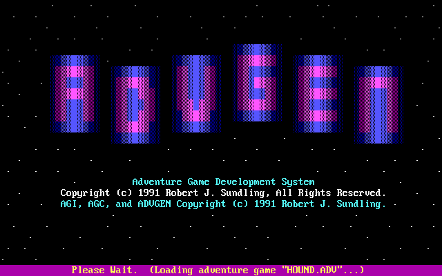
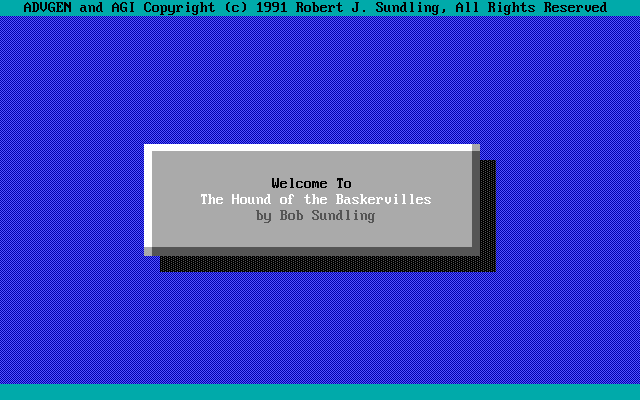
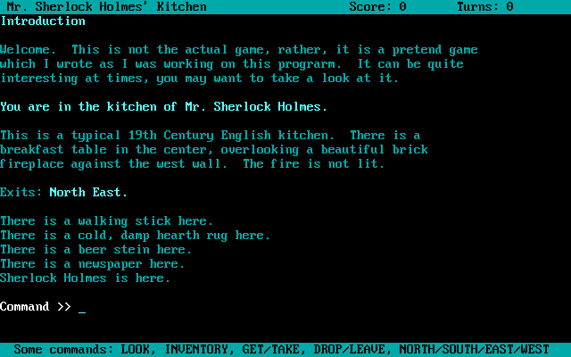
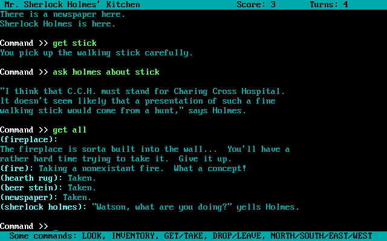
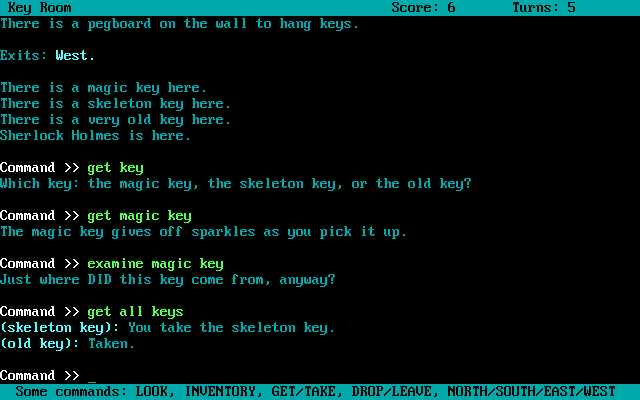

# ADVGEN - Adventure Game Development Kit


ADVGEN is a text adventure game compiler and interpreter system that I wrote in QuickBASIC in 1991 over the course of a month when I was in middle school. It has been untouched since then.

It certainly does not represent best practices, but I am sharing it as a matter of historical interest. It is a fully functional adventure game development system.

## Historical Context

In April of 1991, I was in the eighth grade. My Language Arts teacher knew of my interest in computer programming and asked if I would like to do something "involving computers" as an alternative to the activities that the rest of the class would be doing as we read [*The Hound of the Baskervilles*](https://en.wikipedia.org/wiki/The_Hound_of_the_Baskervilles).

I told her about "text adventure games" (today, known as "interactive fiction") and suggested that I create a text adventure game based on the story, rather than doing the other assignments.

> **An aside:** In 1991, the only option I knew of for creating text adventure games was GAGS 1.00 (the Generic Adventure Game System) from 1985 by Mark J. Welch, which I had found on a local BBS some years prior.
>
> I had always wanted to write a text adventure using it. However, it was a shareware program that sold for \$40 (equivalent to about \$100 in 2025) for the full version including its source code, which was required to do things such as add custom verbs. As a middle school student with no money to buy software, the simplest option seemed to be to simply write my own adventure game development system from scratch.
>
> If you look carefully, you will notice a nod to GAGS in the `HOUND.TXT` example file.

My teacher liked the text adventure idea. I suggested that my friend Gerald, also in the class, could collaborate with me on this: I could build the development tools while he worked on creating the actual adventure game content in the new adventure game programming language that I would create.

Gerald and I got to work. We only had a month to write the entire thing. I had never written a compiler or interpreter before, but there was no reason for that to stop me.

> **Note:** I have not included Gerald's game here, because I do not have his permission to do so. However, I have included a sample "game" that I wrote myself as I was developing the compiler and interpreter, which demonstrates features and capabilities of the system. If at some point I obtain Gerald's permission, I will add his game to this repository. (Unfortunately, his game was never completed. The finished portion is primarily walking around a grid of streets in Victorian London, although there is also a puzzle to get into Sherlock Holmes' home.)

After the month was over, I never came back to this project. Therefore, this is a historical snapshot of the project at that time, with no further development or changes made since then. Even in this state, it is a fully functional adventure game development system that could in fact be used to create complex text adventure games, although I am not sure I would recommend it for that purpose today.

## License

In 1991, this code was originally confidential and written under a proprietary license. As of July 31, 2025, I am re-releasing it under the MIT License.

The original copyright notices remain in the source files to avoid altering them for historical reasons. Their contents and original timestamps are maintained exactly as they existed in 1991. However, these notices have now been superseded and the code is freely available under the MIT License.

See the [LICENSE](LICENSE) file for the full terms and the [NOTICE](NOTICE) file for details about the license change.

## Usage

### Quick Start

To play the included example game `HOUND`, you can run the following commands from a DOS command prompt:

```
CD ADVGEN
AGI HOUND
```

Note that omitting an adventure game file will result in an error message.

### Screenshots

When starting the `AGI` program, you will see an intro screen:



(This intro screen is stored in binary format in the [AGI.INT](ADVGEN/AGI.INT) file.)

Once a game is loaded, a basic title screen is shown. Here is an example from the `HOUND` game:



The game then proceeds to show some introductory text, after which the player is prompted to press a key. The player is then placed in the first room. In this example, it is the kitchen of Sherlock Holmes' house:



The parser supports commands of decent complexity such as asking characters about objects or other topics, as well as interacting with multiple objects at once:



When multiple objects have the same name and the player refers to one of them, the system will prompt them to choose which one they want to interact with. The player can disambiguate them by using adjectives that you define in the game definition files:



Note here how the "magic key" and "skeleton key" both have special actions for taking them, and how the parser figures out the plural for "keys" and acts on all of them in the current room.

See the [HOUND.TXT](ADVGEN/HOUND.TXT) file for the full sample game definition.

### Compiling an Adventure Game

```
AGC inputfile[, outputfile]
```

- **inputfile** - The text file containing the adventure game definitions
- **outputfile** - Optional name for the compiled binary game file (defaults to inputfile with .ADV extension)

#### Example

To compile the example game `HOUND.TXT` into a binary game file, assuming you are in the `ADVGEN` directory, you would run:

```
AGC HOUND
```

### Playing an Adventure Game

```
AGI gamefile
```

- **gamefile** - The compiled .ADV file to play (the .ADV extension *must* be omitted)

#### Example

To play the included `HOUND` game, assuming you are in the `ADVGEN` directory, you would simply run:

```
AGI HOUND
```

The `HOUND` game is a demonstration of the system's features, including room descriptions, object interactions, and some basic NPC behavior.


## Development Environment

The original development environment was [Microsoft QuickBASIC 4.5](https://winworldpc.com/product/quickbasic/45) with the [ADVBAS](https://github.com/RobertSundling/ADVBAS) library.

## Project Structure

### Directories

- [ADVGEN](ADVGEN/) - All files related to the Adventure Game Development Kit
- [ADVBAS](ADVBAS/) - The [ADVBAS library](https://github.com/RobertSundling/ADVBAS), required to build the compiler and interpreter; included as a Git submodule in this repository
- [screenshots](screenshots/) - Contemporary screenshots of the sample `HOUND` game

### Key Files (All in [ADVGEN](ADVGEN/))

#### Executables

- [AGC.EXE](ADVGEN/AGC.EXE) - Adventure Game Compiler - converts text-based game definitions into binary format
- [AGI.EXE](ADVGEN/AGI.EXE) - Adventure Game Interpreter - plays compiled adventure games
- [AGI.INT](ADVGEN/AGI.INT) - Intro screen file for the interpreter

#### Sample Game

- [HOUND.TXT](ADVGEN/HOUND.TXT) - Source code for the example game that I wrote, showing a few rooms and some advanced features of the system
- [HOUND.ADV](ADVGEN/HOUND.ADV) - The compiled binary game file for the `HOUND` example game (created by running `AGC HOUND`)

#### Source Code

- [AGC.BAS](ADVGEN/AGC.BAS) - Adventure Game Compiler source code
- [AGI.BAS](ADVGEN/AGI.BAS) - Adventure Game Interpreter source code
- [AG.QBI](ADVGEN/AG.QBI) - Shared data structures and constants
- [AGI.QBI](ADVGEN/AGI.QBI) - Interpreter-specific global variables
- [VERBS.QBI](ADVGEN/VERBS.QBI) - Verb definitions
- [DRAWBOX.BAS](ADVGEN/DRAWBOX.BAS) - User interface functions, borrowed from another project of mine and reused here
- [AGI.MAK](ADVGEN/AGI.MAK) - QuickBASIC project file for building the interpreter (includes both `AGI.BAS` and `DRAWBOX.BAS`)

#### Documentation

- [AGC.TXT](ADVGEN/AGC.TXT) - Programmer's manual for the Adventure Game Compiler (not in sync with the actual code). This was generated from an `AGC.GEN` file with a proprietary tool I wrote which I no longer have, so I am omitting `AGC.GEN` from this distribution


## Game Definition Language

> **Important note**: Much of this section of this document was written by generative AI (Claude Sonnet 4) based upon its examination of the ADVGEN source code and sample game. I have not yet rewritten or fully reviewed this section myself. As such, this section may not be entirely accurate with the current state of the compiler or interpreter. I have not looked at these files in nearly 35 years, but I wanted to include at least *some* documentation here to explain the features. 
>
> The best reference for the game definition language is going to be the source code itself, particularly the `AGC.BAS` file which contains the compiler logic, the `AGI.BAS` file which contains the interpreter logic, and the sample game which demonstrates the features. The `HOUND.TXT` file in particular was created to test and demonstrate advanced features and edge cases, and was evolved along with the game itself. Everything in `HOUND.TXT` works, so if it is in there, it should be considered a valid feature of the system.

The system uses a structured text format to define adventure games with the following elements:

### Introduction Section
```
Intro
{
   The Hound of the Baskervilles
   Bob Sundling
   Welcome.  This is not the actual game, rather, it is a pretend game
   which I wrote as I was working on this program.
}
```

The first line of the introduction is the game title, followed by the author's name on the second line. The introduction text which follows on subsequent lines is displayed when the game starts.

### Rooms (1-999)
```
Room 1
{
    [Adjective "Mr. Sherlock Holmes'"]  ; Optional prefix adjective
    Name "Kitchen"
    
    Short Description           ; Required - shown on re-entry
    {
        You are in the kitchen of Mr. Sherlock Holmes.
    }
    
    [Long Description]          ; Optional - shown on first entry and LOOK
    {
        This is a typical 19th Century English kitchen. There is a
        beautiful brick fireplace on the west wall.
    }
    
    [Look]                      ; Optional custom look command list
    {
        ; Custom commands when player types LOOK
        IfLoc 1002 = 1
        {
            Display { The fire is burning brightly. }
            Stop
        }
        Display { The fireplace is cold and empty. }
    }
    
    [North 2]                   ; Optional room connections
    [South 3]
    [East 4]
    [West 5]
    [Up 6]
    [Down 7]
    
    [End]                       ; Optional - game ends when player enters this room
    [Points 10]                 ; Optional - points awarded for entering room
}
```

**Note**: Square brackets `[ ]` indicate optional elements. The brackets should not appear in your code. Elements without brackets are required.

### Objects (1000-1998)

Objects can be regular items or NPCs (non-player characters). Here are examples of both:

#### Regular Object Example
```
Object 1000
{
    [Adjective "Golden"]
    Name "Key"
    [Synonym "Passkey"]
    [Synonym "Opener"]
    
    Location 1                  ; Starting location (room number, -1 for player, 0 for out of game)
    [Weight 5]                  ; Weight (affects carrying capacity, default 1)
    [Size 3]                    ; Size (affects carrying capacity, default 1)
    [Points 10]                 ; Points for first interaction
    
    [Short Description]         ; Displayed when object is in room
    {
        There is a golden key here.
    }
    
    [Long Description]          ; Displayed when player looks at object
    {
        This key gleams in the light and appears to be made of solid gold.
    }
    
    ; Object Attributes (all optional)
    [Unmovable]                 ; Cannot be taken
    [Lockable]                  ; Can be locked/unlocked
    [Closable]                  ; Can be opened/closed
    [Readable]                  ; Can be read
    [Pushable]                  ; Can be pushed
    
    ; Verb Command Lists (all optional)
    [Take]
    {
        Display { You carefully pick up the golden key. }
        Points 5
        Default                 ; Execute default take action
    }
    
    [Read]
    {
        Display { The key has "MASTER" engraved on it. }
    }
}
```

#### NPC (Non-Player Character) Example

> NPCs are implemented as objects. Originally there was an intention for there to be a separate "Creature" system, but as development progressed it turned out there was no need to separate them. Therefore, in the source code you may find references to "creatures."
```
Object 1016
{
    [Adjective "Sherlock"]
    Name "Holmes"
    [Synonym "Sherlock"]
    [Synonym "Detective"]
    
    Location 1                  ; Starting room
    
    [Short Description]         ; Displayed when NPC is in room
    {
        Sherlock Holmes is here.
    }
    
    [Long Description]          ; Displayed when player looks at NPC
    {
        The famous detective looks thoughtful as he examines the room.
    }
    
    Follow                      ; Follows player between rooms
    
    [Ask]                       ; Handle ASK HOLMES ABOUT <topic>
    {
        Ifabout "hound"
        {
            Display { "The hound is a most perplexing mystery," says Holmes. }
            Stop
        }
        Ifabout "stick"
        {
            Display { "That walking stick belongs to Dr. Mortimer," Holmes observes. }
            Stop
        }
        Display { Holmes shrugs and says nothing about that topic. }
    }
    
    [Give]                      ; Handle GIVE <item> TO HOLMES
    {
        Ifabout "stick"
        {
            Display { "Thank you for returning this to the kitchen." }
            Move 1000 to 1      ; Move stick to room 1
            Stop
        }
        Display { Holmes doesn't want that. }
    }
    
    [Take]
    {
        Display { "Watson, what are you doing?" yells Holmes. }
    }
}
```

**Note**: Square brackets `[ ]` indicate optional elements. Elements without brackets are required.

### Events (1-32)
```
Event 1
{
    IFLOC -1 = 1                ; When player enters room 1
    {
        Display
        {
            As you walk up to the house, Sherlock Holmes comes out.
            "Watson, where were you?", asks Holmes.
            He then walks back inside the house.
        }
        Addexit West 19 to 1    ; Add west exit from room 19 to room 1
        Killevent 1             ; Disable this event so it only happens once
    }
}
```

Events are background processes that automatically trigger when certain conditions are met. They can be enabled/disabled dynamically and are useful for creating dynamic world changes, timed events, or one-time occurrences.

### Creatures

The original code contained a "Creature" system (2000-2998) that was intended for NPCs, but it was never fully implemented as I realized creatures and objects were not so different. Instead, NPCs should be implemented as objects.

### Commands and Logic

The system supports a rich set of conditional logic and object manipulation commands:

#### Conditional Commands
- **`IFLOC object = location`** - Test if object is at location
- **`IFLOCNOT object = location`** - Test if object is NOT at location  
- **`IFABOUT "string"`** - Test what player is asking about (in ASK commands)
- **`IFABOUT object`** - Test if asking about specific object

`IF` statements can be nested to create complex logic.

#### Action Commands
- **`MOVE object TO location`** - Move object to new location
- **`DISPLAY { text }`** - Show text to player
- **`POINTS number`** - Award points (only once per object/verb combination)
- **`DEFAULT`** - Execute standard verb behavior
- **`STOP`** - Stop executing current command list

#### Object Manipulation
- **`LOCK object`** - Lock an object
- **`UNLOCK object`** - Unlock an object  
- **`OPEN object`** - Open an object
- **`CLOSE object`** - Close an object

#### Advanced Commands
- **`MOVE -1 TO room`** - Move the player to specified room (the keyword `CREATURE` may also be used for player movement instead of `MOVE`, but is a deprecated feature)
- **`STARTEVENT number`** - Enable an event
- **`KILLEVENT number`** - Disable an event
- **`ADDEXIT direction FROM room TO room`** - Add new exit

#### Special Location Values
- **`-1`** - Player's inventory, or the current player
- **`-2`** - Current room where player is standing
- **`0`** - Out of game (removed from play)

#### Supported Verbs
The system recognizes these built-in verbs:
- **TAKE/GET** - Pick up objects
- **DROP/LEAVE** - Put down objects  
- **LOOK** - Examine objects or rooms
- **READ** - Read readable objects
- **OPEN/CLOSE** - Open or close objects
- **LOCK/UNLOCK** - Lock or unlock objects
- **PUSH/TOUCH/PRESS** - Push objects
- **ASK** - Ask creatures about topics
- **GIVE** - Give objects to creatures
- **CLIMB** - Climb objects
- **NORTH/SOUTH/EAST/WEST/UP/DOWN** - Movement

Had I worked on this project longer, I would have almost certainly added the ability to define custom verbs in the game definition files themselves. As it stands, to add a new verb, you would need to modify the `VERBS.QBI` file and recompile the compiler and interpreter. Since the source code is provided here, this is quite doable.

#### Example Command Sequences
```
Take
{
    IfLoc 1005 = 1              ; If rug is in room 1
    {
        Display { You can't take that while the rug is here. }
        Stop                    ; Don't execute default take
    }
    Display { You pick up the item carefully. }
    Points 5                    ; Award 5 points
    Default                     ; Then do normal take action
}

Look
{
    IfLoc 1002 = 1             ; If fire object is present
    {
        Display { The room is warm and cozy with the fire burning. }
        Stop
    }
    Display { The room feels cold and empty. }
}
```

`IF` blocks of various types can be nested to create complex logic.

## Sample Games

- **HOUND** - Demonstration game featuring Sherlock Holmes' kitchen and surroundings. Shows various advanced features including:

  - Basic object interactions (reading the walking stick's inscription)
  - Dynamic object swapping (fire/no fire states)
  - Conditional room descriptions based on object presence
  - NPC interactions (Sherlock Holmes as object 1016 with `Follow` attribute and `Ask`/`Give` verbs)
  - Point scoring system
  - Complex conditional logic with nested IF statements

## Running from Source

The original development environment was Microsoft QuickBASIC 4.5. 

You can compile the source code to create the executables, or simply run from within QuickBASIC to test the compiler and interpreter.

### Prerequisites
- Microsoft QuickBASIC 4.5 (available from [WinWorld](https://winworldpc.com/product/quickbasic/45))
- [ADVBAS v99](https://github.com/RobertSundling/ADVBAS) Advanced Function Library for the BASIC Compiler. This library is included as a Git submodule in this repository, so you can clone it with:
  ```
  git clone --recurse-submodules
  ```
- DOS or Windows environment capable of running QuickBASIC, such as DOSBox or a vintage PC. I recommend [DOSBox-X](https://dosbox-x.com/) for modern systems

### Run Process
1. Change into the `ADVGEN` directory:
    ```
    CD ADVGEN
    ```
2. Start QuickBASIC 4.5 with the ADVBAS library, assuming that ADVBAS.QLB is in your QuickBASIC library path:
    ```
    QB /L ADVBAS
    ```
    If you have not set up your QuickBASIC library path, you can either specify the full path to `ADVBAS.QLB`,
    or copy it to the `ADVGEN` directory, or run QB and from the `Options` menu choose `Set Paths...` to add the library path to the `ADVGEN` directory, then restart QuickBASIC.
3. Open one of the two primary source code files:
   - `AGC.BAS` - for the Adventure Game Compiler
   - `AGI.BAS` - for the Adventure Game Interpreter (the `AGI.MAK` project will be used automatically to load the related files)

   Note that in order for QuickBASIC to find the `.BI` include files, you need to be in the correct directory where the source code is located, or you need to set your include directory to the `ADVGEN` directory. If you forgot to change directories initially, you can open a DOS shell by opening the `File` menu and choosing `DOS Shell`, and then change directories to `ADVGEN` from there.
4. If you are going to run the program, open the `Run` menu then choose `Modify COMMAND$` and enter appropriate command line arguments; for both of these programs with the example adventure game, the correct command line is `HOUND`.
5. Press `F5` to run the program, or choose `Make EXE File...` from the `Run` menu to compile it.